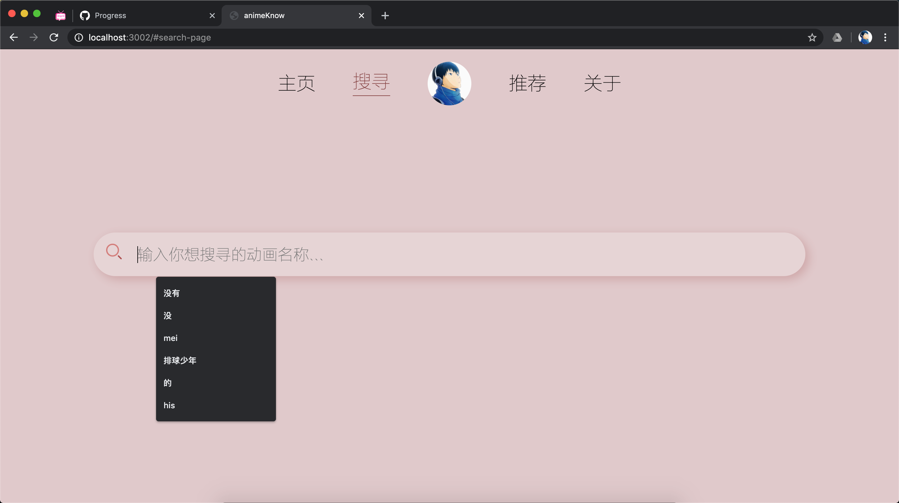
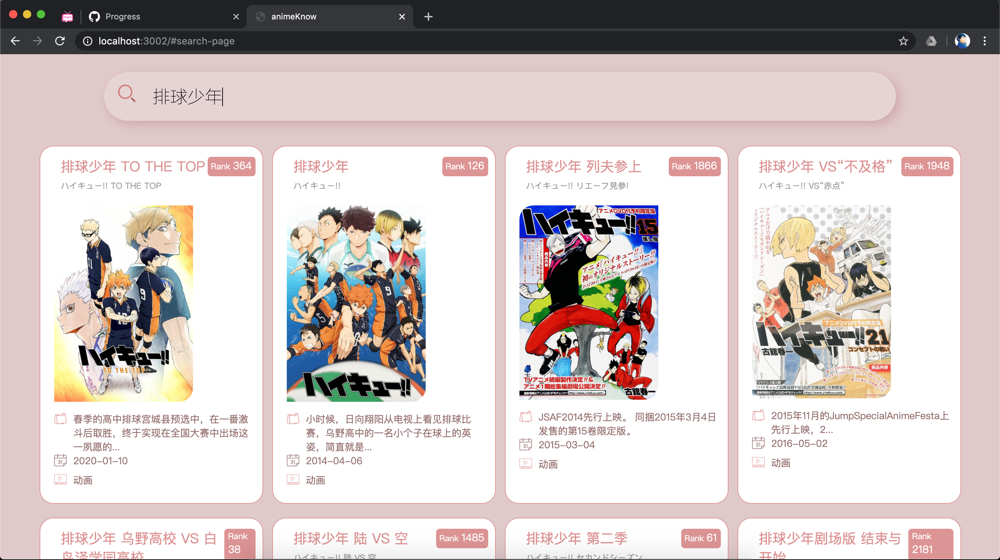
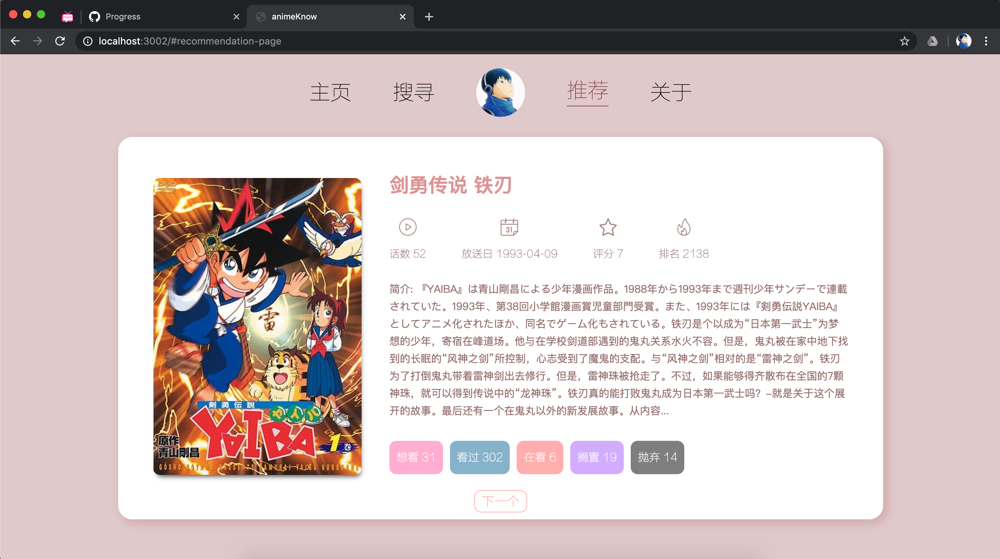
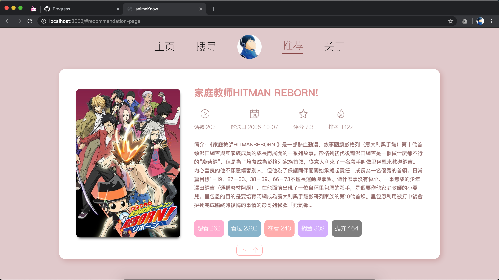
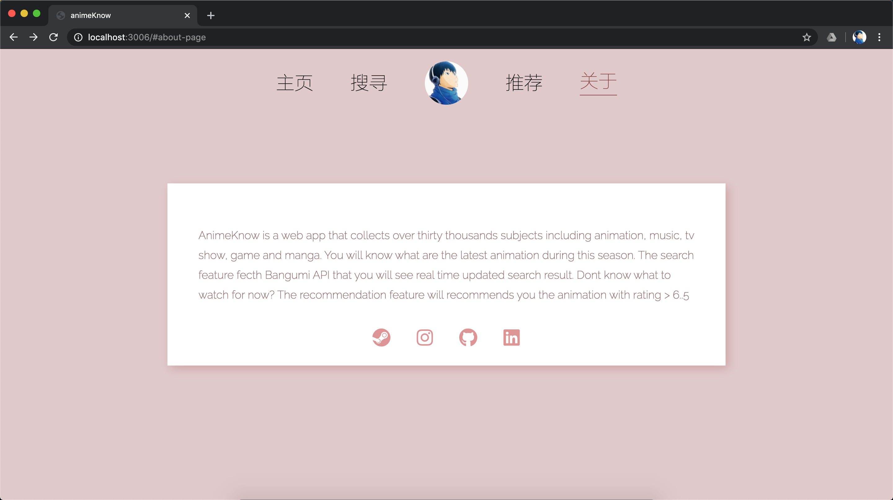

# animeKnow

> https://animeknow.netlify.app

## Table of Contents

- [Introduction](#01)
- [Features](#02)
- [Preview](#03)
- [Technology](#04)
- [Usage](#05)

#

## <span id="01">Introduction</span>

animeKnow is a Web App that built with React.js framework utilized Bangumi API. Bangumi API has tons of subjects database which includes animation, music, books and others. Sometime you dont know what to watch? animeKnow helps you find the animation for you.

#

## <span id="02">Features</span>

- Real time updated animation list for that day
- Search over thirty thousand subjects of animation, manga, film, music and game
- Random recommendation feature that notify you the animatin with good rating
- Bookmark the subject to your account

#

## <span id="03">Demo</span>

<i style="font-size: 13px">Air animation list</i>


<i style="font-size: 13px">Search subjects</i>


<i style="font-size: 13px">Return results after searching</i>


<i style="font-size: 13px">Recommended animation</i>


<i style="font-size: 13px">Recommended animation</i>


<i style="font-size: 13px">About the app</i>


#

## <span id="04">Technology</span>

- HTML5, CSS3
- javaScript
- React
- Node.js
- Firebase
- Bangumi API

#

## <span id="05">Run</span>

```markdown
npm start
```
